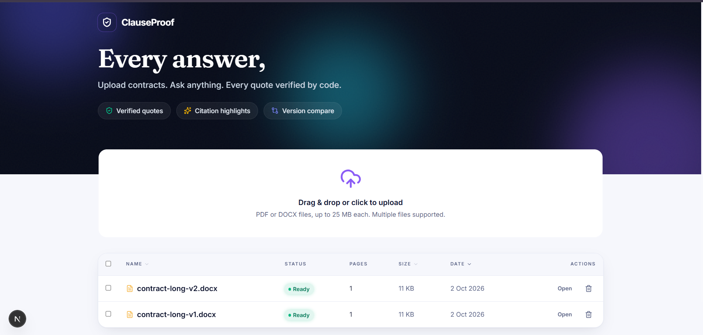
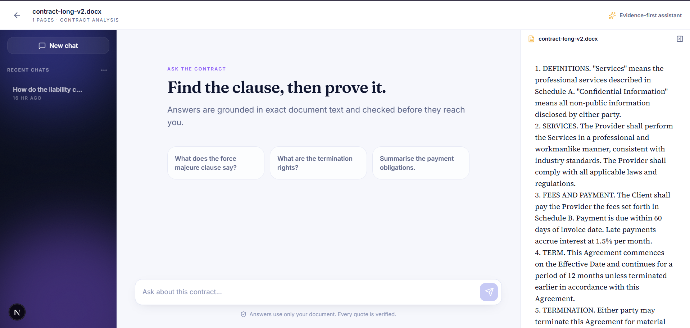
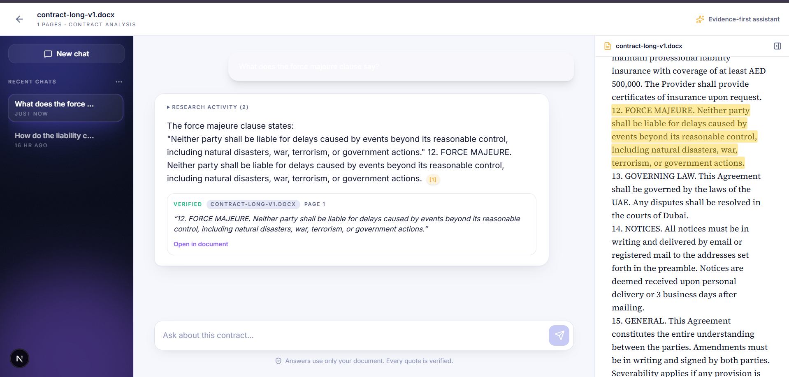
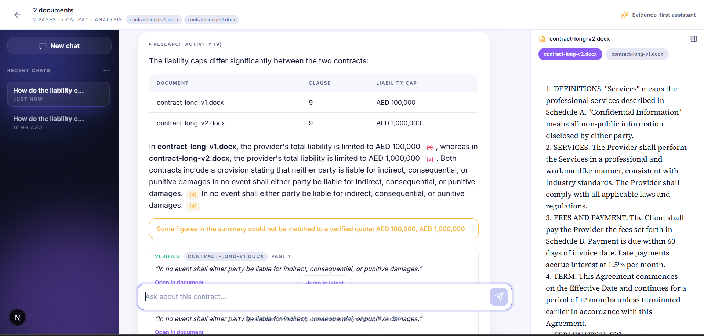
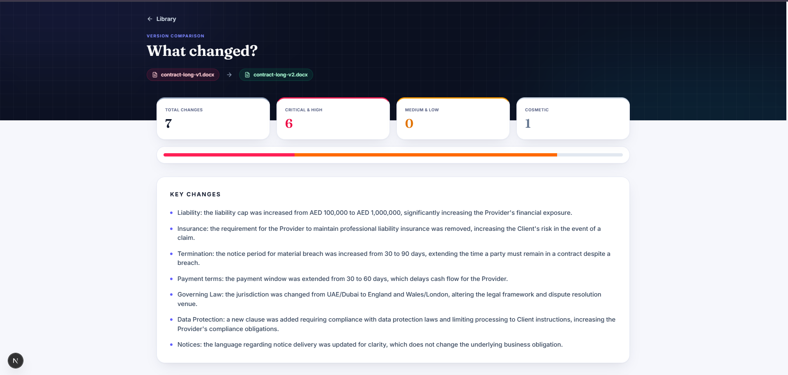
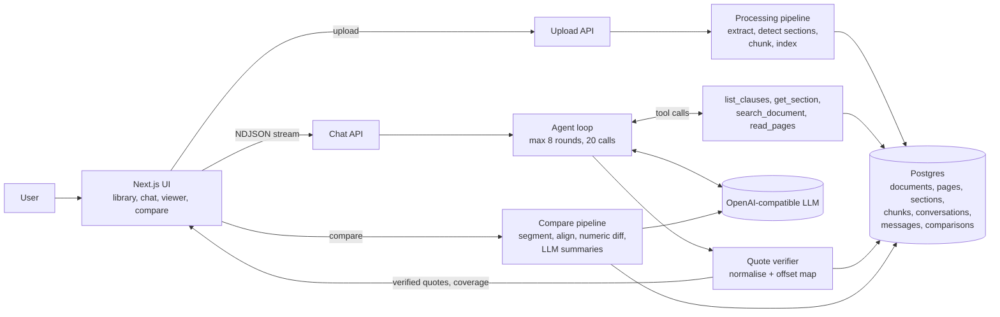

<div align="center">

# ClauseProof

### Every answer, proven.

Upload contracts. Ask anything. Every quote is verified by code against the document before you see it as evidence.

[](https://nextjs.org)
[](https://www.typescriptlang.org)
[](https://orm.drizzle.team)
[](https://vitest.dev)

**[Submission note](NOTE.md)**

</div>

---

## Contents

1. [What it does](#what-it-does)
2. [Screenshots](#screenshots)
3. [How quote verification works](#how-quote-verification-works)
4. [Large documents](#large-documents)
5. [Agentic research (Part C, Option 2)](#agentic-research-part-c-option-2)
6. [Citation highlighting](#citation-highlighting)
7. [Multi-document questions](#multi-document-questions)
8. [Document comparison](#document-comparison)
9. [Architecture](#architecture)
10. [Tech stack](#tech-stack)
11. [Run it locally](#run-it-locally)
12. [Scripts and fixtures](#scripts-and-fixtures)
13. [Tests](#tests)
14. [Project structure](#project-structure)
15. [What is finished and what is not](#what-is-finished-and-what-is-not)

---

## What it does

ClauseProof is a web app for analysing legal contracts. A user uploads PDF or DOCX contracts and asks questions in a chat. The app answers **only from the document**, and backs every answer with exact quotes. Before a quote is shown as evidence, the server checks that it really exists in the document text. Quotes that cannot be found are never presented as genuine.

| Area | What you get |
|---|---|
| **Upload** | PDF and DOCX only (extension and file signature are both checked), live processing status, clear errors, scanned PDFs with no text are rejected instead of being saved as empty documents |
| **Library** | List, open and delete documents, multi-select for comparison and multi-document chat |
| **Chat** | Streaming answers, a Stop button that keeps the partial answer, per-document chat history, new and delete chat |
| **Verified quotes** | Verified (green), close match (amber), unverified (struck through, grouped, never clickable) |
| **Large documents** | A 150-page contract works. The app tracks which pages were actually read and never claims a clause is absent after reading only part of a document |
| **Citation highlighting** | Click a quote to open the document, scroll to the passage and highlight it, including multi-line quotes, quotes crossing a page break, and quotes that appear more than once |
| **Multi-document questions** | Select several documents, ask one question, get one comparative answer, each quote verified against its own document |
| **Document comparison** | Clause-level diff between two versions with plain-language summaries, significance ratings, filters and sorting |
| **Agentic research** | The model calls search and read tools in a capped multi-round loop, with a live activity timeline |

## Screenshots

| Upload and library | Chat with verified quotes |
|---|---|
|  |  |

| Citation highlighting | Multi-document answer |
|---|---|
|  |  |

| Document comparison |
|---|
|  |

## How quote verification works

This is the core requirement, so it is implemented as a pure, heavily tested function (`src/lib/verification`).

1. The model must write every quote as `<quote doc="DOC_ID">exact text</quote>`.
2. Each document gets a **normalised text** plus an **offset map** back to the original text. Normalisation covers Unicode NFKC, curly quotes, dash variants, soft hyphens, zero-width characters, ligatures, words hyphenated across line breaks, all whitespace runs (spaces, tabs, newlines, non-breaking spaces) and case.
3. The quote is normalised the same way and searched for in the normalised document. All occurrences are returned and mapped back to **original offsets and page numbers**.
4. **Positions, pages or offsets reported by the model are ignored completely.** The code locates the quote itself.
5. Result statuses:
   - **verified**: found, with every occurrence and page range
   - **partial**: 8 or more words with at least 95% token similarity to a contiguous passage. Shown as a close match with the real matched text
   - **unverified**: anything else. Struck through, collapsed in its own group, not clickable, not counted as evidence
6. Quotes under 4 words are rejected as too short. Ellipses split a quote into segments that must each appear, in order.
7. In multi-document mode, each quote is verified only against the document named in its `doc` attribute. A quote that exists only in another document is unverified.
8. If an answer has no verified quotes, a banner says so. If the answer is not in the document, the app says that instead of inventing one.
9. Figures in the answer prose (amounts, percentages, durations) are cross-checked against the verified quotes. Unmatched figures get a visible warning.

Unit tests cover whitespace differences, mid-sentence line breaks, hyphenation, curly quotes, case, repeated quotes, quotes spanning a page break, invented and paraphrased quotes, too-short quotes, ellipses, cross-document attribution, and Unicode text.

**Where it can fail** (see also [NOTE.md](NOTE.md)): if text extraction scrambles the reading order (tables, headers and footers interleaved), a genuine quote may not be found. Over-aggressive normalisation could in theory merge distinct text. OCR-garbled text will not match what the model reads.

## Large documents

The full document is never sent to the model in one request. Documents are split into section-aware chunks with full-text and trigram search, and the model reads only what it needs through tools.

- **Coverage tracking:** every page returned by a tool is recorded. The UI shows `Read N of M pages` per document.
- **No false absence claims:** if coverage is incomplete, the model is instructed to say *"I did not find it in the sections I searched"* and must never say a clause does not exist.
- A synthetic **150-page contract** with a clause on page 140 is part of the fixtures and the tests.

## Agentic research (Part C, Option 2)

Instead of pushing document text into the prompt, the model gets tools and decides what to look up.

| Tool | Purpose |
|---|---|
| `list_clauses` | Clause numbers, titles and pages |
| `get_section` | Text of a clause or section (paginated) |
| `search_document` | Ranked passages from full-text and trigram search |
| `read_pages` | A range of pages (capped) |
| `list_documents` | The documents selected for this conversation |

- **Real multi-round loop** with parallel tool calls.
- **Hard caps:** 8 rounds, 20 tool calls and an output budget. At the cap the model must write a final answer that states what it could and could not verify.
- **Live activity timeline** in the chat ("Searching for force majeure...", "Reading section 14 (page 140)"), saved with the message and restored from history.
- **Malformed or invented tool calls** (unknown tool, invalid JSON, missing or extra arguments, documents that were not selected) return a structured error to the model and never crash the request. Concatenated parallel-call arguments from streaming are split and handled.
- Verified quotes still apply to the final answer.
- Provider details handled: Gemini 3 thought signatures are echoed back with their tool calls.

## Citation highlighting

The viewer renders PDFs with pdf.js (lazy, virtualised pages with a text layer) and DOCX files as HTML.

- Click a verified quote and the viewer scrolls to the passage and highlights it.
- The highlight is computed with the **same normalisation and offset map as the verifier**, mapped onto the rendered text spans, so it survives differences between extracted text and the rendered page.
- Handles quotes that wrap across **several lines**, **cross a page break** (one highlight segment per page), and **appear more than once** (previous and next occurrence controls).
- If the exact text cannot be pinpointed, it scrolls to the page and tells the user instead of failing silently.

## Multi-document questions

Select two or more documents in the library and click **Ask across N documents**. The agent can only see the selected documents, tracks coverage per document, and writes one comparison (a table plus short prose) rather than separate answers. Every quote card shows a coloured chip with the document name, and clicking it opens that document's tab in the viewer with the passage highlighted.

## Document comparison

1. Both documents are segmented into clauses (using detected sections, falling back to paragraphs).
2. Clauses are aligned by number and title, then by text similarity. Each is classified as unchanged, modified, added, removed or moved. The unit of change is the clause, never a character diff.
3. Changed amounts, durations, percentages and dates are extracted **deterministically** (for example `AED 100,000 -> AED 1,000,000`), so a number change is never missed even if the model misses it.
4. The model writes a plain-language summary and a significance rating (critical, high, medium, low, cosmetic) for each change, in batches. A rule in code stops real numeric changes from being rated cosmetic or low, and a clause reworded with the same meaning stays cosmetic.
5. If the model fails for a clause, the card is marked "AI summary unavailable" and no fake summary is shown.
6. The results page has an overall summary, counts by significance, filters (significance, type), sorting (significance or document order), word-level diffs inside each clause, and **Open in older / newer** buttons that jump to the clause in the viewer.

## Architecture



**Design principle:** the model is never trusted for facts about the document. Locations come from code, quotes are verified by code, coverage is measured by code, and numbers in comparisons are extracted by code. The model writes language; the code checks it.

## Tech stack

| Layer | Choice |
|---|---|
| Framework | Next.js (App Router), React, TypeScript (strict) |
| UI | Tailwind CSS, shadcn/ui, lucide-react, hand-written CSS animations |
| Database | PostgreSQL (Supabase), Drizzle ORM, full-text search and `pg_trgm` |
| Documents | `pdfjs-dist` (extraction and rendering), `mammoth` (DOCX) |
| AI | Any OpenAI-compatible API through the `openai` SDK (tested with Gemini's OpenAI-compatible endpoint) |
| Validation | Zod for every tool call and API payload |
| Tests | Vitest |

## Run it locally

**Prerequisites:** Node.js 20 or newer, a Postgres database (a free Supabase or Neon project works), and an API key for any OpenAI-compatible LLM provider.

```bash
# 1. Install
git clone <repo-url>
cd legal-contract-analyser
npm install

# 2. Configure
cp .env.example .env.local
# fill in DATABASE_URL, LLM_API_KEY, LLM_BASE_URL and LLM_MODEL

# 3. Create the database schema
npx drizzle-kit push
# also enable the trigram extension once, in your SQL editor:
#   create extension if not exists pg_trgm;

# 4. Start
npm run dev
# open http://localhost:3000
```

**Try it quickly:** upload the files from `tests/fixtures/` (see below). Ask "What does the force majeure clause say?" on `long-contract.pdf`, then compare `contract-long-v1.docx` with `contract-long-v2.docx`.

## Scripts and fixtures

| Command | What it does |
|---|---|
| `npm run dev` | Start the development server |
| `npm run build` / `npm start` | Production build and server |
| `npm run lint` | Lint |
| `npm test` | Run the unit tests |
| `npx drizzle-kit push` | Apply the database schema |
| `npx tsx scripts/make-fixtures.ts` | Generate the sample, scanned and 150-page fixtures |
| `npx tsx scripts/make-compare-fixtures.ts` | Generate the comparison fixture pairs |
| `npx tsx scripts/test-compare.ts` | End-to-end check of the comparison against the planted changes |
| `npx tsx scripts/backfill-norm.ts` | Recompute normalised text for already uploaded documents |

**Fixtures in `tests/fixtures/`**

| File | Purpose |
|---|---|
| `sample-contract.pdf` / `.docx` | Small text contract in both formats |
| `long-contract.pdf` | 150 pages, with a force majeure clause on page 140 |
| `scanned-contract.pdf` | Image-only PDF, must be rejected with a clear message |
| `contract-v1.docx` / `contract-v2.docx` | Four-clause comparison pair |
| `contract-long-v1.docx` / `contract-long-v2.docx` | 15-clause comparison pair with seven planted changes (liability cap AED 100,000 to AED 1,000,000, payment 30 to 60 days, termination notice 30 to 90 days, governing law UAE to England and Wales, a reworded clause, an added clause, a removed clause) |

## Tests

```bash
npm test
```

Unit tests live in `tests/unit` and cover the verifier and normalisation, quote parsing, the agent loop (caps, malformed tool calls, unselected documents, abort), thought-signature handling, conversation lifecycle, comparison alignment, numeric extraction and the significance rules, and the viewer's highlight mapping. Tests that need a live database skip themselves when `DATABASE_URL` is not set.

## Project structure

```
src/
  app/                    Pages and API routes (library, documents/[id], compare, api/*)
  components/             UI: uploader, library, chat, quote cards, viewer, comparison
  lib/
    agent/                Tool-calling loop (run.ts) and the tools (tools.ts)
    compare/              Segmentation, alignment, numeric diff, classification
    db/                   Drizzle client and schema
    document-processing/  Extraction, section detection, chunking
    llm/                  OpenAI-compatible client, retries, streaming
    verification/         Normalisation, quote verification, quote parsing
scripts/                  Fixture generators, comparison check, backfill
tests/
  fixtures/               Sample contracts
  unit/                   Vitest suites
docs/screenshots/         Images used in this README
```

## What is finished and what is not

**Finished**

- Part A: upload and processing (PDF and DOCX, status, scanned-PDF detection), document library, streaming chat with Stop and saved history, verified quotes, large-document handling with coverage tracking
- Part B: citation highlighting (multi-line, cross-page, duplicates), multi-document questions, document comparison with significance, filters and sorting
- Part C: Option 2, agentic document research with caps, live activity, and malformed-call handling

**Not built**

- Part C Option 1 (tracked-change redlining), by choice. Option 2 reuses the retrieval and verification layers and directly prevents the failure the brief calls worst: claiming a clause is absent after reading part of a document
- Optional extras: anonymisation, embeddings and semantic search, answer export, clause extraction, Arabic and right-to-left layout, background job recovery, voice input
- OCR. Scanned PDFs are rejected with a clear message rather than read

**Known limitations**

- Highlighting depends on the PDF text layer matching the extracted text. When the exact passage cannot be pinpointed, the viewer shows the page instead
- Comparison quality depends on clause detection. Unusual numbering styles may be segmented as paragraphs
- DOCX files have no fixed pages, so they are shown as a single flowing document
- Quote verification can miss a genuine quote when extraction scrambles the reading order (tables, headers and footers)
- Free-tier LLM limits can make answers slow or rate-limited. The app retries and shows a friendly message, but heavy use on a free key will throttle

---

<div align="center">

Built for the engineering assignment. See [NOTE.md](NOTE.md) for the design notes and what I would build next.

</div>